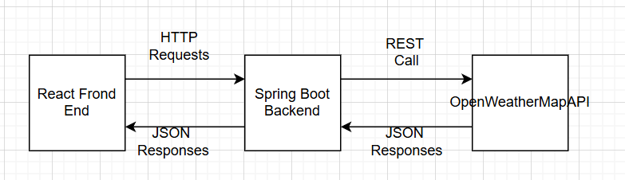
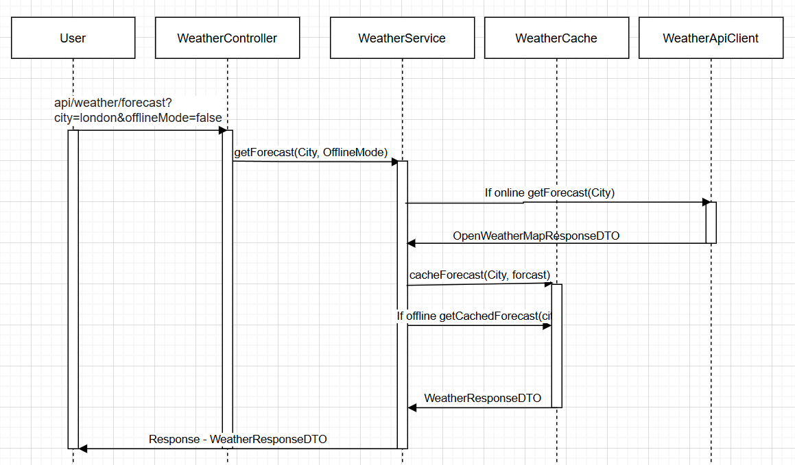

# weather-app
----------

### **Weather Forecast**

This microservice provides a 3-day weather forecast for any city, showing daily high and low temperatures. It also adds
contextual alerts based on weather conditions:

1. [x] Carry umbrella if rain is predicted
2. [x] Use sunscreen lotion if temperature exceeds 40°C
3. [x] It’s too windy, watch out! if wind speed > 10 mph
4. [x] Don’t step out! A Storm is brewing! if thunderstorms are detected

### **Features**

1. [x] Accepts city and optional offlineMode as input parameters.
2. [x] Returns a clean summary of the next 3 days with necessary alerts.
3. [x] Supports offline fallback using cached weather data.
4. [x] Designed for extensibility, new alert conditions can be added with minimal code and without requiring major
   redeployments.

### **System Architecture Overview**

The application follows a client-server architecture with:

* **Frontend:** React.js (Single-Page Application)

* **Backend:** Java and Spring Boot (REST API)

* **Data Source:** OpenWeatherMap API (External)

* **API Documentation:** Swagger/OpenAPI

* **Security:** Spring basic security for API access

### **Implementation Approach**

1. **REST API Design**

   Endpoint: GET /api/weather/forecast?city={city}&offlineMode={boolean}

   Response:

   json
   {
   "city": "London",
   "forecasts": [
   {
   "date": "2023-10-20",
   "maxTemp": 22.5,
   "minTemp": 15.3,
   "alerts": ["Carry umbrella"]
   }
   ]
   }

2. **Caching Strategy**

   Cache Key: City name

   Eviction Policy: Time-based (1 hour)

   java
   @Cacheable(value = "forecasts", key = "#city")
   public WeatherResponse getForecast(String city) { ... }

3. **Error Handling**

    * Custom exceptions (WeatherApiException, ValidationException)

    * HTTP Status Codes:

          400 (Bad Request) for invalid inputs
          404 (Not Found) if city not found
          500 (Internal Server Error) for unexpected errors
          503 (Service Unavailable) if OpenWeatherMap API fails

4. **Offline Mode**

   Returns cached data when offlineMode=true

   Falls back to cached data if API fails

### **Sequence Diagram**

### **Design Patterns**

* **Singleton Pattern:** Spring components are singletons by default
* **Facade Pattern:** WeatherApiClient acts as a facade to the external weather API
* **Decorator Pattern:** Used in processing weather data by adding alerts to the forecast
* **Circuit Breaker Pattern:** Implemented using Resilience4j to handle API failures gracefully
* **Bulkhead Pattern:** Used to limit the concurrent calls to client API

### **Production Readiness**

* **Externalized Configuration:** API keys and URLs in properties files
* **Health Checks:** Spring Boot Actuator endpoints
* **Caching:** Offline mode support
* **Logging:** Structured logging with SLF4J
* **Error Handling:** Custom exceptions and global handler
* **API Documentation:** Swagger/OpenAPI
* **Containerization:** Docker support
* **CI/CD Pipeline:** Automated build, test, and deploy